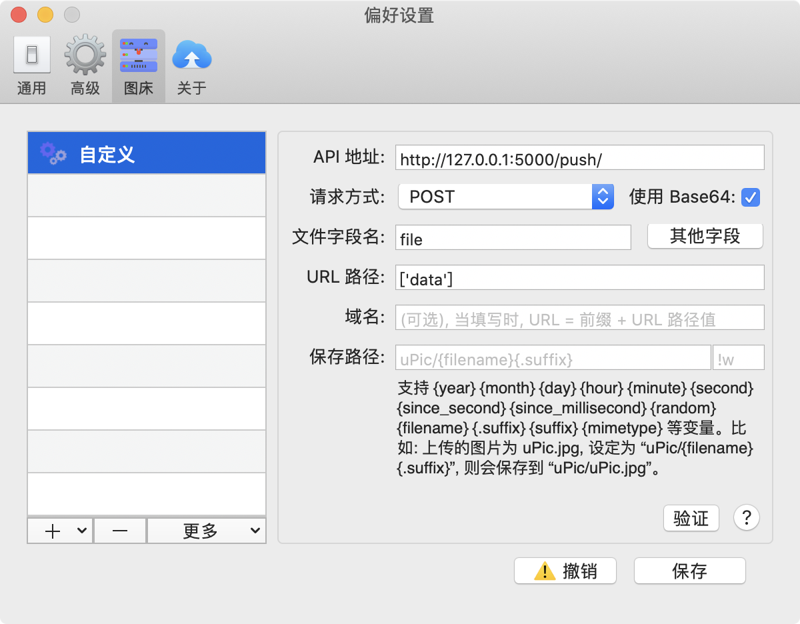

## 1 配置uPic

uPic 版本 0.21.1

安装： `brew install bigwig-club/brew/upic --cask`

### 1.1 自定义图床



1. 设置API地址；
2. 请求方式POST，勾选使用Base64；
3. 文件字段名影响发送给服务中文件内容的key；
4. URL路径设置的是返回给uPic图片地址的URL读取路径。

### 1.2 设置其他字段

点击**其他字段**后点击**增加Body字段**添加数据：


1. 新增filename和suffix；
2. 新增secret并修改值。

## 2 配置服务

### 2.1 创建环境变量

编辑`.env`文件为：

```
export FLASK_HOST=""
export PUSH_SECRET=""
export FLASK_APP=app.py
```

### 2.2 Python环境

```
python3 -m venv .venv
source .venv/bin/activate
pip install flask
```

### 2.3 启动服务

```
mkdir -p src/static/img
source .env
cd src && flask run
```
